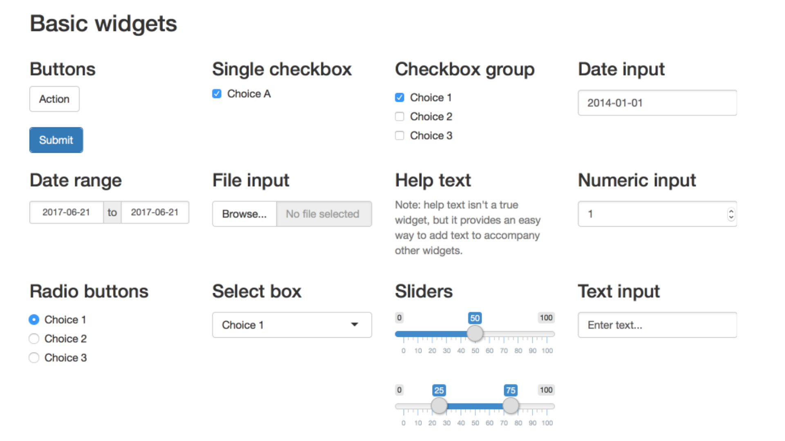

class: center, middle, inverse, title-slide

```{r, child = "_slides-setup.Rmd"}
```

<h1 class = "celeste-ish" style="line-height: 90px; margin-top: -50px;">
    Clase 6:
    Shiny
</h1>

<p style="margin-bottom: -40px;"> &nbsp; </p>


<h3 class = "celeste-ish" style = "position: absolute; bottom: 80px;">
  Autor: Lucio Cornejo
</h3>

---
class: middle

## Shiny

El paquete **Shiny** nos permite crear aplicaciones web empleando **R** 
(o **R Markdown** ), sin necesidad de conocer los lenguajes HTML, CSS y JavaScript
de desarrollo web.

Sin emmbargo, es posible emplear aquellos tres lenguajes junto a **Shiny**,
para crear aplicaciones más complejas o para personalizar el diseño de las
aplicaciones.

<p style="margin-bottom: 20px;"> &nbsp; </p>

## Ejemplos

- [Memory Hex game](https://dreamrs.shinyapps.io/memory-hex/?_ga=2.118371084.487097544.1645368539-1789728895.1639621429)
- [Genome viewer](https://gallery.shinyapps.io/genome_browser/?_ga=2.118371084.487097544.1645368539-1789728895.1639621429)
- [Movie explorer](https://shiny.rstudio.com/gallery/movie-explorer.html)

---
class: middle

## Instalación

```r
install.packages("shiny")
```

<p style="margin-bottom: -30px;"> &nbsp; </p>


## Primer ejemplo

<p style="margin-bottom: -80px;"> &nbsp; </p>

En un nuevo archivo **.R**, insertemos el siguiente código:

```r
library(shiny)
runExample("01_hello")
```

<p style="margin-bottom: -20px;"> &nbsp; </p>

## Versión alternativa del primer ejemplo

<p style="margin-bottom: -80px;"> &nbsp; </p>

Analicemos rápidamente 
[este archivo](https://github.com/lucio-cornejo/taller-r-markdown/blob/main/_material/clase-6/ejemplo-shiny-01.Rmd)
.

---
class: middle

## Más ejemplos

Pueden ejecutar los siguientes comandos en **R** para ver modelos de
aplicaciones donde se explican algunas de las funcionalidades básicas de
**Shiny**:

```r
runExample("01_hello")       # un histograma
runExample("02_text")        # tablas y data frames
runExample("03_reactivity")  # una expresión reactiva
runExample("04_mpg")         # variables globales
runExample("05_sliders")     # barras deslizantes
runExample("06_tabsets")     # paneles (tabsets)
runExample("07_widgets")     # botones y texto de ayuda
runExample("08_html")        # aplicación Shiny construida desde HTML
runExample("09_upload")      # botón para cargar archivos
runExample("10_download")    # botón para descargar archivos
runExample("11_timer")       # mostrar la hora actual
```

???

Ver rápidamente los ejemplos 5, 7, 9 y 10.

---

## Control widgets

<p style="margin-bottom: -80px;"> &nbsp; </p>

Un widget es un elemento web con el cual los usuarios pueden interactuar.

<p style="margin-bottom: -60px;"> &nbsp; </p>



[Galería](https://shiny.rstudio.com/gallery/widget-gallery.html)
con el código de los widgets disponibles vía **Shiny**.

???

Explorar rápidamente el archivo **ejemplo-shiny-02.Rmd** .
---

## Creación reactiva de elementos web

<p style="margin-bottom: 20px;"> &nbsp; </p>

Función |	Elemento creado
:---: | :---:
renderDataTable |	Tabla de datos vía JavaScript
renderImage |	imágenes cargadas vía link
renderPlot |	gráficos
renderPrint |	resultado impreso
renderTable |	Tabla _convencional_ 
renderText | Cadena de caracteres
renderUI |	Elemento de HTML o su versión análoga en Shiny

---
class: middle

## Reportes parametrizados: Parte II

Volveremos a trabajar con el primer reporte parametrizado
que se creó en este taller, el de temperaturas mensuales
promedio en Nottingham.

### Versión 1

Modificaremos el reporte previo con el fin
que en la página web donde se visualiza tal reporte sea
posible modificar el **año de interés** y que se actualice 
la data y gráficos relevantes del reporte.

[Modelo]()

### Versión 2

Crearemos una aplicación web donde se pueda fijar el 
**año de interés** para el reporte y descargar la versión
parametrizada del reporte (_respecto al año fijado_)
vía un simple click de un botón.

[Modelo]()

---