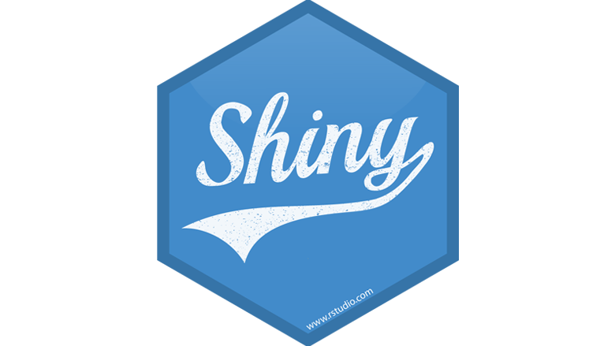

class: center, middle, inverse, title-slide

```{r, child = "_slides-setup.Rmd"}
```

<h1 class = "celeste-ish" style="line-height: 90px; margin-top: -50px;">
    Clase 6:
    Shiny
</h1>

<p style="margin-bottom: -40px;"> &nbsp; </p>



<h3 class = "celeste-ish" style = "position: absolute; bottom: 80px;">
  Autor: Lucio Cornejo
</h3>

---
class: middle

## Shiny

El paquete **Shiny** nos permite crear aplicaciones web empleando **R** 
(o **R Markdown** ), sin necesidad de conocer los lenguajes HTML, CSS y JavaScript
de desarrollo web.

Sin emmbargo, es posible emplear aquellos tres lenguajes junto a **Shiny**,
para crear aplicaciones más complejas o para personalizar el diseño de las
aplicaciones.

<p style="margin-bottom: 20px;"> &nbsp; </p>

## Ejemplos

- [Memory Hex game](https://dreamrs.shinyapps.io/memory-hex/?_ga=2.118371084.487097544.1645368539-1789728895.1639621429)
- [Genome viewer](https://gallery.shinyapps.io/genome_browser/?_ga=2.118371084.487097544.1645368539-1789728895.1639621429)
- [Movie explorer](https://shiny.rstudio.com/gallery/movie-explorer.html)

---

## Instalación

```r
install.packages("shiny")
```

<p style="margin-bottom: -30px;"> &nbsp; </p>


## Primer ejemplo

<p style="margin-bottom: -80px;"> &nbsp; </p>

En un nuevo archivo **.R**, insertemos el siguiente código:

```r
library(shiny)
runExample("01_hello")
```

## Versión alternativa del primer ejemplo

Analizemos rápidamente 
[este archivo]()
.