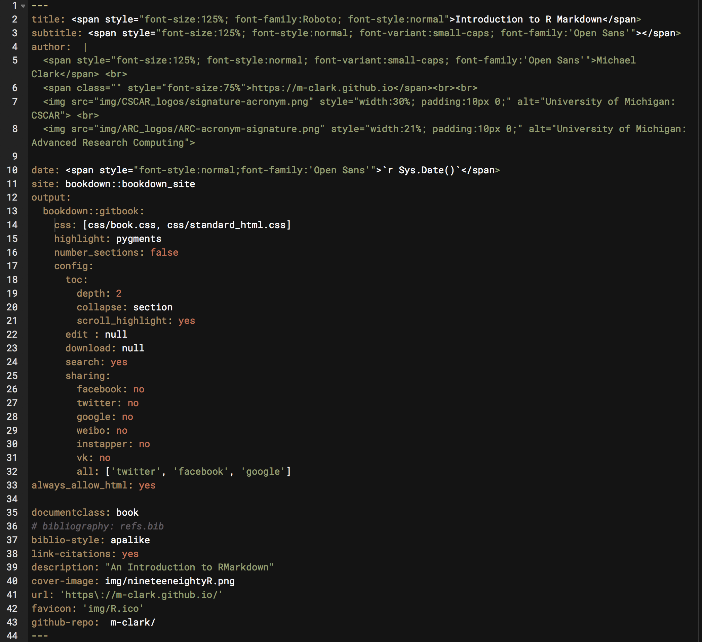

class: center, middle, inverse, title-slide

```{r setup, include=FALSE}
xaringanExtra::use_panelset()
xaringanExtra::use_tile_view()
knitr::opts_chunk$set(echo = TRUE)
```

<h1 class = "celeste-ish">
    Clase 1:
    <p style="margin-bottom: -120px;"> &nbsp; </p>
    Markdown y YAML
</h1>

<p style="margin-bottom: 150px;"> &nbsp; </p>

<h3 class = "celeste-ish">
  Autor: Lucio Cornejo
</h3>

---

## ¿De qué me sirve saber R Markdown?

- Para crear **reportes [reproducibles](https://www.youtube.com/watch?v=EvoVb_QLRK8&ab_channel=HealthcareTriage)**.

- Para generar, a partir de **un solo archivo**, una multitud de
formatos (página web, Word, PDF, diapositivas HTML, etc) en el cual 
publicarlo.

<br>

## Filosofía de R Markdown

<p style="margin-bottom: -50px;"> &nbsp; </p>

> Cambiemos nuestra actitud tradicional hacia la construcción de 
> programas: en lugar de imaginar que nuestra tarea principal es 
> instruir a una computadora sobre lo que debe hacer, 
> concentrémonos en explicar a los seres humanos lo que queremos 
> que haga una computadora.
>
> --- Donald Knuth &nbsp;&nbsp;&nbsp;&nbsp;(Literate Programming, 1983)

---
class: center, middle

## ¿Osea?

<iframe width="560" height="315" src="https://www.youtube.com/embed/s3JldKoA0zw" title="YouTube video player" frameborder="0" allow="accelerometer; autoplay; clipboard-write; encrypted-media; gyroscope; picture-in-picture" allowfullscreen></iframe>

---
class: middle

## ¿Qué es R Markdown?

Es un paquete del lenguaje de programación **R** que permite integrar en
un único documento el **texto**, **código** y los **resultados** de un
análisis o proyecto.

El **texto** se escribe en los formatos
<span class="resaltar">YAML</span> y 
<span class="resaltar">Markdown</span>, 
lenguajes de marcado que exploraremos en esta clase.

El **código** puede ser de
<span class="resaltar">R</span>, 
<span class="resaltar">C</span>, 
<span class="resaltar">Python</span>, 
entre otros.

Los **resultados** se pueden exportar una variedad de tipos
de archivos, gracias al software 
<span class="resaltar">Pandoc</span>.

<br>

---

## Instalación

```{r, eval = FALSE}
# Ejecuta los siguientes comandos en la consola de R
install.packages("knitr")
install.packages("rmarkdown")
```

<br>

## En accción

Abrir **RStudio** y copiar el contenido del archivo **R Markdown**
en este [link](https://raw.githubusercontent.com/lucio-cornejo/taller-r-markdown/main/_material/clase-1/ejemplo.Rmd).

<p style="margin-bottom: -20px;"> &nbsp; </p>

<center>

</center>

???

Asegurarse que cada asistente realizó las instalaciones requeridas
en el archivo R Markdown compartido.
---

## ¿Cómo funciona R Markdown?

<p style="margin-bottom: 40px;"> &nbsp; </p>


???

Fechas de publicación:

- pandoc: 10/08/2006
- knitr: 17/01/2012
- rmarkdown: 24/02/2014

---

## Estructura de un documento Rmd

<p style="margin-bottom: 10px;"> &nbsp; </p>

<center>

</center>

---

## Markdown

Es un lenguaje de marcado muy útil para escribir
de manera simple contenido usualmente para la web,
ya sea para libros o blogs.

Contrario a la imagen anteriormente presentada sobre
cómo funciona **R Markdown**, en este taller
no siempre usaremos el software **Pandoc** para 
convertir nuestro archivo **Markdown**.
Más adelante, usaremos **Hugo** para la creación
de nuestro sitio web; y, la librería _Remark.js_
de **JavaScript** para la creación de diapositivas 
vía el paquete _Xaringan_ de **R Markdown**.

<p style="margin-bottom: -10px;"> &nbsp; </p>

<center>

</center>

???

Iniciar demostración en Visual Studio Code.

---

## YAML

Este lenguaje (no de programación) sirve para definir 
**propiedades principales** respecto al archivo **Rmd** 
con el que se trabaje. 

 **YAML** consiste en texto que emplea
**<span style="font-size: 25px;">sangría de 2 espacios</span>**
para definir características como el título, fecha, formato de salida, etc,
de un documento <br>( **R Markdown** (**Rmd**), en nuestro caso).

Se ubica en la parte superior de cada archivo **Rmd**, entre un par de
tres guiones (**---** ), sección a la cual se denomina
**encabezado YAML** o **metadata**.

El encabezado **YAML** no suele ser de gran extensión (menos de 10 líneas de texto),
al menos para reportes simples, pero, pueden llegar a ser tan sofisticados como
lo desees.

A continuación, un ejemplo extenso (no es necesario lo lean a detalle)
de un **encabezado YAML** :

---

<p style="margin-bottom: -30px;"> &nbsp; </p>

<center>

</center>

---

##  Ejemplos de encabezados YAML 

```yaml
---
title: "Reporte 1"
output: html_document
---
```

La manera de definir **propiedades** es simple:

```yaml
alguna_propiedad: un_valor_posible
```

Además, podemos definir **atributos** a **propiedades**
previamente declaradas, siempre y cuando tales **atributos** tengan el
mismo espaciado (2 espacios vacíos) en el encabezado,
**respecto a la propiedad** que están modificando.

```yaml
---
title: "Reporte 1"
output: 
  html_document:
    toc: true
    toc_float: true
---
```

---

En el ejemplo previo, &nbsp;`html_document`&nbsp; dejó de ser solamente el 
**valor** de la **propiedad** &nbsp;`output`&nbsp;, y ahora es también una
**propiedad** ... **propiedad** a la cual se le añadió los **atributos**
&nbsp; `toc: true`&nbsp; y &nbsp; `toc_float: true`, ambos con un espaciado de **2 espacios vacíos**
respecto al valor de la propiedad que están modificando.

Pueden entender **atributo** y **propiedad** como lo mismo, simplemente quería
evitar decir _propiedad de propiedad_. Estas _cadenas_ de propiedades y atributos (uno dentro de la otra)
pueden hacerse tan largas como se desee (ver diapositiva 10), pero, en este taller,
nuestros encabezados **YAML** serán usualmente de este tipo:

```yaml
---
title: "Algún título"
author: "tu nombre"
output:
  html_document:
    toc: true    # incluir tabla de contenidos (lista de encabezados)
    toc_depth: 3 # motrar en la toc los encabezados de nivel tres o menor nivel
    toc_float: true # mantener fija la toc en la esquina superior izquierda de la página web
    theme: darkly # un modelo predeterminado del estilo visual de nuestra página
    highlight: tango # un modelo predeterminado de cómo resaltar el código de la página web
---
```

---
class: center, middle

Para explorar varias de las propiedades que pueden definir vía el 
**encabezado YAML** para sus documentos **R Markdown**, pueden
entrar a este 
[link](https://cran.r-project.org/web/packages/ymlthis/vignettes/yaml-fieldguide.html),
o, si desean incluso más opciones (y mejor explicado), 
les recomiendo este [PDF](https://cran.r-project.org/web/packages/ymlthis/ymlthis.pdf)
del paquete **ymlthis**.