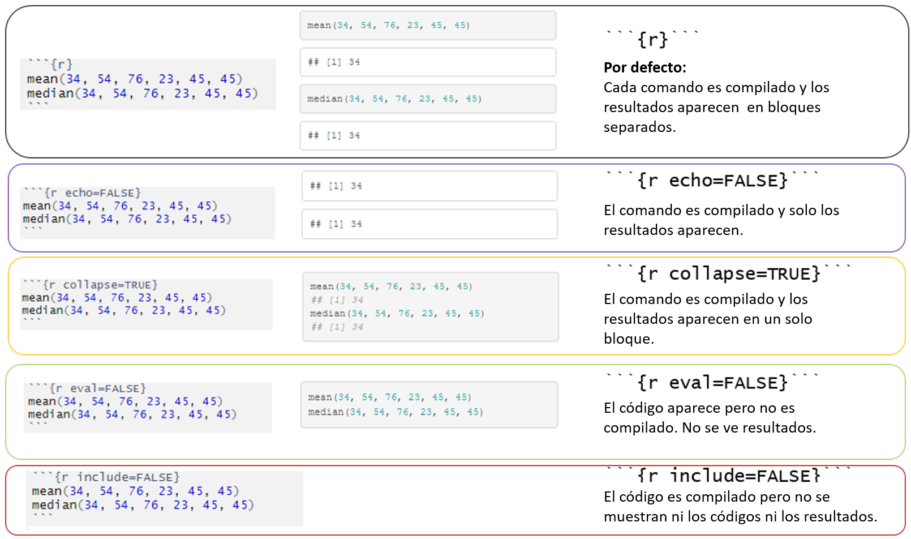

class: center, middle, inverse, title-slide

```{r setup, include=FALSE}
xaringanExtra::use_panelset()
xaringanExtra::use_tile_view()
knitr::opts_chunk$set(echo = TRUE)
```

<h1 class = "celeste-ish">
    Clase 2:
    <p style="margin-bottom: -120px;"> &nbsp; </p>
    Reportes parametrizados
</h1>

<p style="margin-bottom: 150px;"> &nbsp; </p>

<h3 class = "celeste-ish">
  Autor: Lucio Cornejo
</h3>

---

## Repaso rápido de la sesión pasada

### Estructura de un documento Rmd

<p style="margin-bottom: -20px;"> &nbsp; </p>

<center>

</center>

<p style="margin-bottom: 20px;"> &nbsp; </p>

### ¿Cómo se generan los archivos?

<p style="margin-bottom: -20px;"> &nbsp; </p>


???

¿Alguien hizo su tarea y desea compartirla con nosotros?

---
class: middle
## Objetivos de esta sesión:

--

1. Aprender a insertar **código** en un documento **R Markdown**.

--

1. Familiarizarnos con el formato **html_notebook**.

--

1. Realizar un reporte no parametrizado.

--

1. **Parametrizar** el reporte creado anteriormente.

---

## _Chunks_ : Bloques de código

La sesión pasada, aprendimos que **Markdown** nos permite incluir código
tanto en línea como en bloques, pero para **resaltarlo**; 
en cambio, **R Markdown** sí lo **ejecutará**.

.pull-left[
**Markdown** 

Código en línea:
```md
El comando `mean(edades)` sirve para calcular la media 
de un vector denominado _edades_ .
```

<p style="margin-bottom: -47px;"> &nbsp; </p>

Bloque de código:
````
```r
edades <- c(1,2,3)
mean(edades)
```
````
]

.pull-right[
**R Markdown** 

Código en línea:
.scrollable[
```{r, comment="", echo = FALSE}
cat("La media del vector _edades_ vale `r mean(edades)`.")
```
]

<p style="margin-bottom: -40px;"> &nbsp; </p>

Chunk:

```` 
\`\`\`{r}
edades <- c(1,2,3)
mean(edades)
```
```` 

]

---

## Propiedades principales de chunks

<p style="margin-bottom: -20px;"> &nbsp; </p>




???

Mostrar propiedades de **chunks** en **RStudio**,
trabajando todos juntos.

---

## Chunks de diversos lenguajes

**R Markdown** admite código de cualquiera de los siguiente lenguajes:

<details>
  <summary>Presionar el triángulo rotado para mostrarlos u octultarlos.</summary>
    
    awk<br>
    bash<br>
    coffee<br>
    gawk<br>
    groovy<br>
    haskell<br>
    lein<br>
    mysql<br>
    node<br>
    octave<br>
    perl<br>
    psql<br>
    Rscript<br>
    ruby<br>
    sas<br>
    scala<br>
    sed<br>
    sh<br>
    stata<br>
    zsh<br>
    highlight<br>
    Rcpp<br>
    tikz<br>
    dot<br>
    c<br>
    cc<br>
    fortran<br>
    fortran95<br>
    asy<br>
    cat<br>
    asis<br>
    stan<br>
    block<br>
    block2<br>
    js<br>
    css<br>
    sql<br>
    go<br>
    python<br>
    julia<br>
    sass<br>
    scss<br>
    R<br>
    bslib<br>
    theorem<br>
    lemma<br>
    corollary<br>
    propositio<br>
    conjecture<br>
    definition<br>
    example<br>
    exercise<br>
    hypothesis<br>
    proof<br>
    remark<br>
    solution<br>
</details>

<p style="margin-bottom: -20px;"> &nbsp; </p>

Ejemplos:

**Python** 
```` 
```{python, echo = FALSE, eval=FALSE}`r ''`
# Podemos añadir varias propiedades a un mismo chunk,
# separándolas con coma.

import numpy as np

x = np.cos(0) # vale 1
y = np.sin(0) # vale 0

print(x**2 + y**2) # vale 1
```
```` 

---

**JavaScript** 

<p style="margin-bottom: -60px;"> &nbsp; </p>

.scrollable[
```` 
```{js mi-primer-chunk, include=FALSE}`r ''`
// Podemos nombrar a cada chunk, ya sea para hacer referencia 
// a ellos en nuestro documento Rmd, facilitar el poder ejecutar
// varias veces un mismo chunk, o simplemente para ser más ordenados.

document.addEventListener(
  "DOMContentLoaded", //
  function() {
    // Definimos un array con los meses del año
    let meses = ["enero","febrero","marzo","abril","mayo","junio","julio","agosto","setiembre","octubre","noviembre","diciembre"];

    // Obtener fecha de hoy
    let fecha = new Date();

    // Obtener qué día es hoy
    let numeroDeDia = fecha.getDate();

    // Crear una ventana con un mensaje particular
    alert(`Hoy es ${numeroDeDia} de ${meses[fecha.getMonth()]}.`)
  }
)
```
````
] 

---

## ¿Qué es un reporte parametrizado?

Es un documento **dinámico** que cambia en función de la **input** 
proporcionada por el usuario o una aplicación.

<p style="margin-bottom: -35px;"> &nbsp; </p>

## ¿Para qué nos sirve un reporte parametrizado?

Nos permite _automatizar_ la creación de reportes o documentos que poseen
un **modelo similar** (template/plantilla) y los cuales se tienen
que producir con **cierta frecuencia** .

Por ejemplo:

- Análisis de data respecto a algún fenómeno natural periódico.
- Algunos reportes mensuales o anuales sobre ventas de algún negocio.
- Horarios.
- Certificados.

---

## Manos a la obra

<p style="margin-bottom: -80px;"> &nbsp; </p>

<small>
Para cada link en azul, copiar su contenido (presionar ctrl+A y luego ctrl+C), pegarlo en un nuevo
archivo Rmd y guardarlo con el mismo nombre del texto azul;
todos los archivos en una misma carpeta.
</small>

<p style="margin-bottom: -70px;"> &nbsp; </p>

<a href = "https://raw.githubusercontent.com/lucio-cornejo/r-markdown-summer-workshop/main/_material/clase-2/0-html-notebook.Rmd" download="0-html-notebook">
0-html-notebook.Rmd
</a>
<p style="margin-bottom: -80px;"> &nbsp; </p>
- Objetivos:
  - Crear nuestro primer html_notebook.
  - Familiarizarnos con propiedades de chunks.

<a href = "https://raw.githubusercontent.com/lucio-cornejo/r-markdown-summer-workshop/main/_material/clase-2/1-parametrizacion-basica.Rmd" download="1-parametrizacion-basica">
1-parametrizacion-basica.Rmd
</a>
<p style="margin-bottom: -80px;"> &nbsp; </p>
  - Objetivos:
      + Crear nuestro primer reporte parametrizado.
      + Parametrizar el notebook creado,
        pero ahora presentado como un documento HTML, 
        pues no hay más código que añadir, solo que ejecutar.
      + Instalaremos el paquete **Shiny** de **R** para hacer 
        más interactiva la manera en que definimos parámetros del reporte/documento, 
        esto gracias a los comandos `rmarkdown::render("my-file.Rmd",params="ask")`
        y _knit with parameters_.

???

Guardar en ua misma carpeta todos los archivos R Markdown que crearemos ahora.

---

<a href = "https://raw.githubusercontent.com/lucio-cornejo/r-markdown-summer-workshop/main/_material/clase-2/2-parametrizacion-interactica.Rmd" download="2-parametrizacion-interactiva">
2-parametrizacion-interactiva.Rmd
</a>
  - Objetivo: Crear un menú interactivo para definir los parámetros.

<a href = "https://raw.githubusercontent.com/lucio-cornejo/r-markdown-summer-workshop/main/_material/clase-2/3-horario-parametrizado.Rmd" download="3-horario-parametrizado">
3-horario-parametrizado.Rmd
</a>
  - Objetivo:
      + Usar parámetros en forma de vectores, para evitar
        tener que definir una gran cantidad de parámetros,
        sino más bien parámetros que contienen varios valores.

<a href = "https://raw.githubusercontent.com/lucio-cornejo/r-markdown-summer-workshop/main/_material/clase-2/4-certificado-parametrizado.Rmd" download = "4-certificado-parametrizados">
4-certificado-parametrizados.Rmd
</a>
  - Objetivo: Producir varias versiones de un mismo archivo. 

<p style="margin-bottom: -40px;"> &nbsp; </p>

Último ejemplo:<br>
<https://rmarkdown.rstudio.com/articles_mail_merge.html>
(no descargar)

---
class: middle

## Links opcionales en caso deseen profundizar más sobre documentos parametrizados:

- <https://garrettgman.github.io/rmarkdown/developer_parameterized_reports.html>

- <https://bookdown.org/yihui/rmarkdown/parameterized-reports.html>

- <https://www.youtube.com/watch?v=oFKb8WYDLB0&ab_channel=BryanJenks>