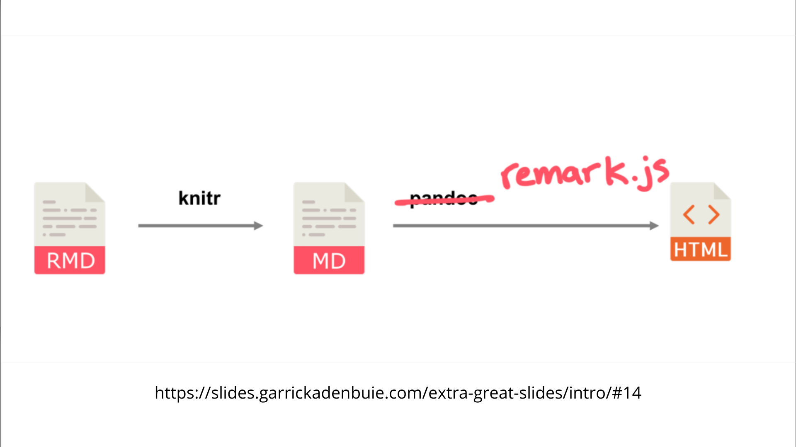

class: center, middle, inverse, title-slide

```{r setup, include=FALSE}
xaringanExtra::use_panelset()
xaringanExtra::use_tile_view()
xaringanExtra::use_fit_screen()
knitr::opts_chunk$set(echo = TRUE)
```

<h1 class = "celeste-ish" style="line-height: 90px; margin-top: -50px;">
    Clase 3:
    <p style="margin-bottom: -170px;"> &nbsp; </p>
    Xaringan y <br>
    creación de <br>
    sitios web<br>
    con R Markdown
</h1>

<p style="margin-bottom: -5px;"> &nbsp; </p>

<h3 class = "celeste-ish">
  Autor: Lucio Cornejo
</h3>

---

## Repaso rápido de la sesión pasada

### Chunks: Bloques de código

<p style="margin-bottom: -40px;"> &nbsp; </p>

```` 
```{r}`r ' '` 
edades <- c(1,2,3)
mean(edades)
```

```{r}`r ' '`
*#| echo = TRUE,
*#| eval = FALSE 

mean(edades)
```

```{r}`r ' '`
*#| echo: TRUE
*#| eval: FALSE

mean(edades)
```
```` 

<p style="margin-bottom: -60px;"> &nbsp; </p>

.scrollable[
```` 
```{js chunk-de-javascript, include=FALSE}`r ''`
document.addEventListener("click", function() {
  // Definimos un array con los meses del año
  let meses = ["enero","febrero","marzo","abril","mayo","junio","julio","agosto","setiembre","octubre","noviembre","diciembre"];

  // Obtener fecha de hoy
  let fecha = new Date();

  // Obtener qué día es hoy
  let numeroDeDia = fecha.getDate();

  // Crear una ventana con un mensaje particular
  alert(`Hoy es ${numeroDeDia} de ${meses[fecha.getMonth()]}.`)
}
);
```
````
] 

<br>

### Reportes parametrizados

````yaml
---
title: "..."
params: 
  edad: 23
  actividades:
    value:
      lunes: ["odiar los lunes","comer lasagna"]
output: html_document
---

...


```{r}`r ''` 
edad <- params$edad
actividad <- params$actividades$lunes[1]
```
````

````yaml
---
title: "..."
params: 
  anio: 
    label: "Año"
    value: 1938
    input: slider
    min: 1920
    max: 1939
    step: 1
  file:
    label: "Data para analizar"
    value: temperaturas.xlsx
    input: file
output: html_document
---
````

???

Comentar sobre que _reportes parametrizados_ se considera avanzado:

Diapositiva 9 del primer link (no Rmd)
><https://arm.rbind.io/days/day2/>

---
class: center, middle
background-image: linear-gradient(45deg, red, white)


---
class: center

## ¿Por qué emplear Xaringan?

Para ...

<br>

--

- Crear una presentación **reproducible** ... incluso puede ser **parametrizada**.

<br>

--

- Emplear diapositivas más interactivas, gracias a estar en formato HTML.

<br>

--

- Redactar apuntes y que la presentación final se actualice automáticamente 
a medida que escribimos en las diapositivas.

<br>

--

- ~~Dejar de ocultar que odias Beamer.~~

---

## ¿Cómo funciona?

<p style="margin-bottom: -20px;"> &nbsp; </p>



---

## Manos a la obra

<p style="margin-bottom: -20px;"> &nbsp; </p>

### Etapa 0

```r
install.packages('xaringan')
```

<br>

### Etapa 1

```text
---
title: "Mi primera presentación con Xaringan"
*output: xaringan::moon_reader
---
```

<br>


### Etapa 2

**Activemos el ...** 

---
background-image: url("images-and-gifs/infinite-tsukuyomi.png")
background-size: cover

---

## Propiedades de las diapositivas

### Encabezados

Podemos emplear encabezados para denotar secciones del documento,
de la misma manera usual que hemos estado haciendo en **R Markdown**,
via el símbolo `#`.

### Crear nueva diapositiva

Escribimos &nbsp; `---` &nbsp; para crear una nueva dispositiva.<br>
Los simbolos &nbsp; `---` &nbsp; del _ecabezado YAML_ son la excepción,
pues **R** se encargará de entender tales guiones apropiadamente.

<p style="margin-bottom: -60px;"> &nbsp; </p>

Ejemplo:

```text
---
output: xaringan::moon_reader
---

## Diapositiva 2

---

## Diapositiva 3

```

---

### Presentación secuencial

También es posible esconder ciertos elementos de la diapositiva y 
mostrarlos recién a medida que se avanza hacia las diapositivas siguientes,
vía el uso de &nbsp; `--` &nbsp; .


- Primer ítem

--

- Segundo ítem

--

- Tercer ítem

--

<p style="margin-bottom: -30px;"> &nbsp; </p>

Código:

```md
- Primer ítem

--

- Segundo ítem

--

- Tercer ítem
```

---

### Notas del presentador

```md
## diapositiva x

...

???

notas ocultas que se muestran al presionar la tecla P

---

```

<p style="margin-bottom: -30px;"> &nbsp; </p>

### Estilo visual

```r
names(xaringan:::list_css())
```

Ejemplo:

```yaml
--- 
title: "..."
output:
  xaringan::moon_reader:
  css: [ki-fonts, uo-fonts]
---
```

<p style="margin-bottom: -30px;"> &nbsp; </p>

Como hay una inteferencia entre los estilos escogidos en el YAML,
debido al tipo de letra (_fonts_), el último tipo de letra en el
_array_ asociado al atributo **css** será el empleado en las diapositivas.

???

Dar 3 minutos para que los alumnos personalicen sus valores
en el **css** del YAML.
---

<p style="margin-bottom: -20px;"> &nbsp; </p>

.pull-left[

### Alineamiento

<p style="margin-bottom: -30px;"> &nbsp; </p>

**class:**

horizontal:
  - left
  - center
  - right

<p style="margin-bottom: -20px;"> &nbsp; </p>

vertical:
  - top
  - middle
  - bottom
]

.pull-right[

### Imagen de fondo

<p style="margin-bottom: -30px;"> &nbsp; </p>

.scrollable[
```text
background-image: url("`r xaringan:::karl`")

background-position: center # top, right, bottom left

background-size: contain # cover
```
]

**background-size: contain**

Escala la imagen lo más grande posible, **sin estirar la imagen** ni sobrepasar
a su contenedor. Si el contenedor es más grande que la imagen,
esta última empezará a repertirse, a menos que se declare previamente

background-repeat: no-repeat

**background-size: cover**

Escala la imagen lo más posible para llenar a su contenedor,
**estirando la imagen si es necesario**. 
En caso sea necesario, se delimitará la imagen 
para que no quede espacio en blanco.

]


???

Añade las tildes inversas donde se necesite:

background-image: url("` r xaringan:::karl`")

background-image: linear-gradient(45deg, red, white)


---

## Asignación de clases de CSS gracias a Remark.js

Ejemplos:

.panelset[
.panel[.panel-name[Alineacón de texto]
```text
.center[
Este texto está centrado.
]
```

.center[
Este texto está centrado.
]

<br>
<br>

Ahora, instalemos el paquete [xaringanExtra](https://github.com/gadenbuie/xaringanExtra)
e incluyamos `xaringanExtra::use_panelset()` en un R chunk.

]

.panel[.panel-name[Paneles horizontales]

```text
.panelset[
.panel[.panel-name[nombre_panel1]

...

]

.panel[.panel-name[nombre_panel2]

...

]

]
```
]

.panel[.panel-name[Paneles verticales]

```text
.panelset.sideways[
.panel[.panel-name[nombre_panel1]
...
]

.panel[.panel-name[nombre_panel2]
...
]
]
```

]

.panel[.panel-name[Dividir la diapositiva en dos regiones de igual grosor]

```text

.pull-left[
...
]

.pull-right[
...
]
```

]
]

???

Mencionar algunas funcionalidades de xaringanExtra.

---

## Algunas propiedades vía YAML para Xaringan

.scrollable[
```yaml
---
title: "tu título"
output:
  xaringan::moon_reader:
    self_contained: false
    css: [default, default-fonts]
    seal: false # no incluir la diapositiva título automática
    nature:
      highlightStyle: github 
      highlightLines: true 
      countIncrementalSlides: true
      slideNumberFormat: "%current%"
      ratio: 16:9
---
```
]

---

## Inclusión de gráficos interactivos

<center>
```{r, echo= FALSE}
library(leaflet)
leaflet() %>% addTiles() %>% setView(-77.0794, -12.0695, zoom = 15)
```
</center>

---
class: middle

<center>
```{r, echo= FALSE, message=FALSE, warning = FALSE}
library(plotly)
p <- plot_ly(z = volcano, type = "surface")
p 
```
</center>

---
class: middle

<center>
```{r, echo= FALSE, message=FALSE, warning = FALSE}
library(threejs)
library(maptools)
library(maps)

data(world.cities, package="maps")
cities <- world.cities[order(world.cities$pop,decreasing=TRUE)[1:1000],]
value  <- 100 * cities$pop / max(cities$pop)

globejs(bg="white", lat=cities$lat,     long=cities$long, value=value, 
        rotationlat=-0.34,     rotationlong=-0.38, fov=30)


# earth <- "http://eoimages.gsfc.nasa.gov/images/imagerecords/73000/73909/world.topo.bathy.200412.3x5400x2700.jpg"
# globejs(img=earth, bg="white")
```
</center>

---
class: center, middle

## Links para profundizar en Xaringan

[Funcionalidades extra vía el paquete xaringanExtra](https://github.com/gadenbuie/xaringanExtra)

[Más diseños y estilos visuales vía el paquete xaringanthemer](https://pkg.garrickadenbuie.com/xaringanthemer/articles/xaringanthemer.html)

[Guía oficial de Xaringan](https://bookdown.org/yihui/rmarkdown/xaringan.html)

---

## Creación de un sitio web con R Markdown

Comandos iniciales para **Git Bash**:

```text
git config --global user.name "usuario_de_cuenta_github"
git config --global user.email "email_de_cuenta_github"
git config --list
```

<p style="margin-bottom: -30px;"> &nbsp; </p>

Modelo básico para un sitio web creado con **R Markdown**:

**_site.yml**:

```text
output: html_document
```

**index.Rmd**:

```text
---
title: "Mi sitio web"
---

```