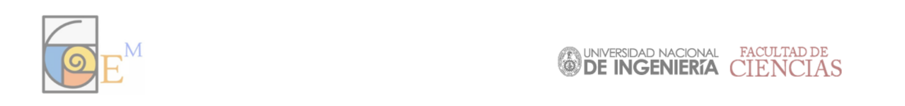

<style>
.remark-slide-number { display: none; }

#texto * {
  font-family: Arial;	
  font-size: 15px;
  line-height: 25px;
}

img {
    margin: 0;
    padding: 0;
    display: block;
    transform: scale(1.25);
}

#logo0 {
    margin-top: -3vh;
    margin-left: 1vw;
}

#logo1 {
    margin-left: -2.2vw;
}

.expositor {
    font-weight: bold;
}
</style>




<div id="texto">
    <center>
        <strong style="font-size: 30px;">CERTIFICADO</strong>
    </center>

    <p>LA ASOCIACIÓN ESTUDIANTIL GEM CERTIFICA QUE:</p>

    <center>
        <strong style="font-size: 23px;">
            `r params$expositor`
        </strong>
    </center>
    
    <p style="margin-bottom: -30px;"> &nbsp; </p>

    <p>
        HA PARTICIPADO COMO 
        <strong>
            CONFERENCISTA 
        </strong>
        EN EL CICLO DE CHARLAS DIVULGATIVAS REMOTAS VÍA ZOOM Y CON FECHA
        `r params$fechaExpo`,
        MEDIANTE LA EXPOSICIÓN TITULADA
    </p>
    
    <p style="margin-bottom: -15px;"> &nbsp; </p>

    <center>
        <strong style="font-size: 23px;">
            `r params$tituloExpo`
        </strong>
    </center>
    
    <p style="margin-bottom: -30px;"> &nbsp; </p>

    <p>
        SE EXPIDE EL PRESENTE CERTIFICADO PARA LOS FINES QUE ESTIME CONVENIENTE.
    </p>
    
    <p style="margin-bottom: -40px;"> &nbsp; </p>

    <p style="float: right; margin-right: 6vw;">
        LIMA,
        `r params$fecha`
    </p>
</div>    

<p style="margin-bottom: 20px;"> &nbsp; </p>


```{r crear-certificados, echo=FALSE, eval=FALSE}
data_expos = data.frame(
                expositor <- c(
                                "PHD. LEYTER POTENCIANO",
                                "PHD. ENRIQUE ROJAS",
                                "PHD. ALBA MÁLAGA",
                                "PHD. ROXANA LÓPEZ",
                                "PHD. JESÚS RAMOS",
                                "PHD ENRIQUE CHAVEZ",
                                "JIMMY ESPINOZA",
                                "PHD. JUAN PEYPOUQUET",
                                "ROMMEL BAZALAR",
                                "JAFER VITO GUTIÉRREZ"
                                ),

                fechaExpo = c(
                              "7 DE OCTUBRE DE 2021",
                              "15 DE OCTUBRE DE 2021",
                              "21 DE OCTUBRE DE 2021",
                              "29 DE OCTUBRE DE 2021",
                              "4 DE NOVIEMBRE DE 2021",
                              "18 DE NOVIEMBRE DE 2021",
                              "25 DE NOVIEMBRE DE 2021",
                              "2 DE DICIEMBRE DE 2021",
                              "7 DE DICIEMBRE DE 2021",
                              "16 DE DICIEMBRE DE 2021"
                              ),

                tituloExpo = c(
                               "UN PROBLEMA INVERSO DE DISPERSIÓN",
                               "FÍSICA DE PLASMAS ESPACIALES Y COMPUTACIÓN CIENTÍFICA",
                               "AVANCES RECIENTES EN EL ESTUDIO DE TOROS PLANOS COMO POLIEDROS",
                               "EL IMPACTO DEL RETARDO EN LA DINÁMICA POBLACIONAL",
                               "CUBRIMIENTO DE TABLEROS Y POLINOMIOS",
                               "PASEOS ALEATORIOS: UNA DESCRIPCIÓN GENERAL",
                               "TEOREMAS TAUBERIANOS PARA SERIES DE DIRICHLET Y APLICACIONES",
                               "ACCELERATED FIRST ORDER METHODS IN CONVEX OPTIMIZATION",
                               "VALORES DE FUNCIONES ZETA MULTIVARIABLES EN PUNTOS ENTEROS",
                               "EL TEOREMA DE GAUSS-BONNET"
                               )
)

fecha <- c("12 DE ENERO DEL 2022")

# Crear certificado en HTML
for(i in 1:nrow(data_expos)) {
  rmarkdown::render(
             input="certificate-creation-automatization.Rmd",
             output_file = paste("certificado",i,".html",sep=""),
             params=list(
                        expositor = data_expos$expositor[i],
                        fechaExpo = data_expos$fechaExpo[i],
                        tituloExpo = data_expos$tituloExpo[i],
                        fecha = fecha
                    )
  )
}

# Convertir certficado en HTML a PDF
# Requiere instalar el paquete pagedown
for(i in 1:nrow(data_expos)){
  pagedown::chrome_print(paste("certificado",i,".html",sep=""))
}
```