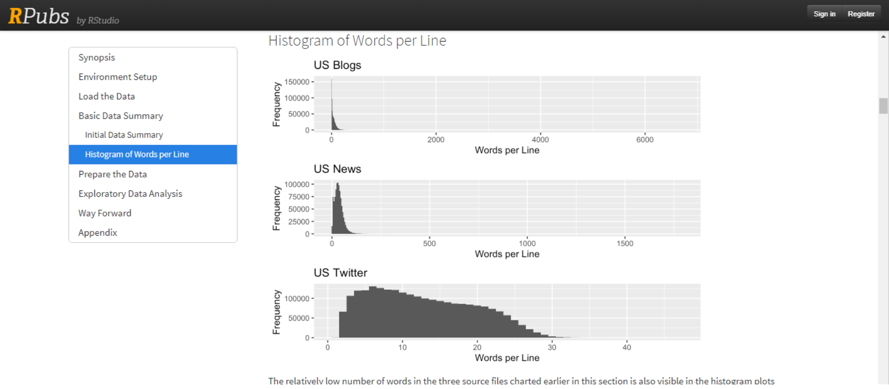
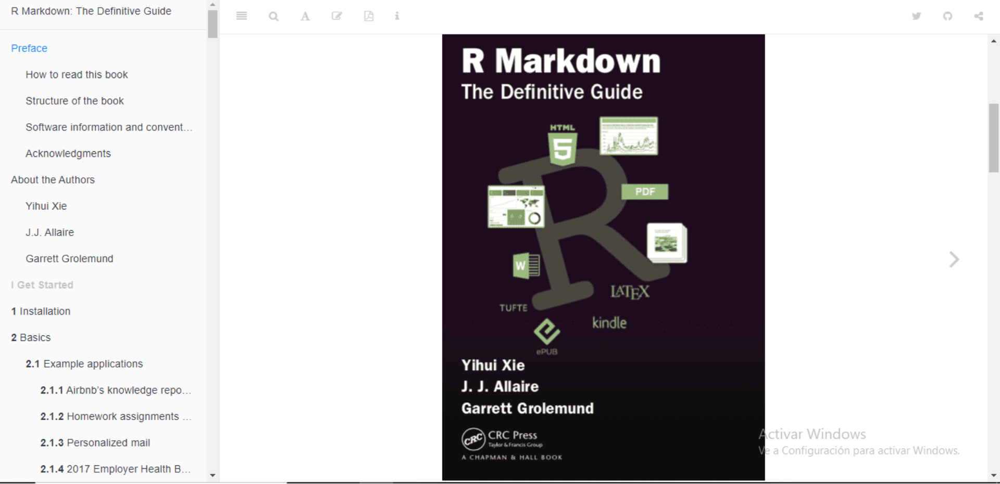
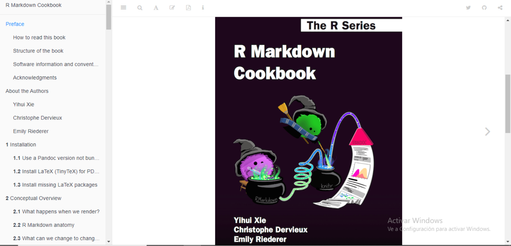
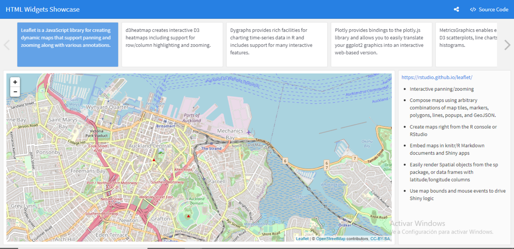
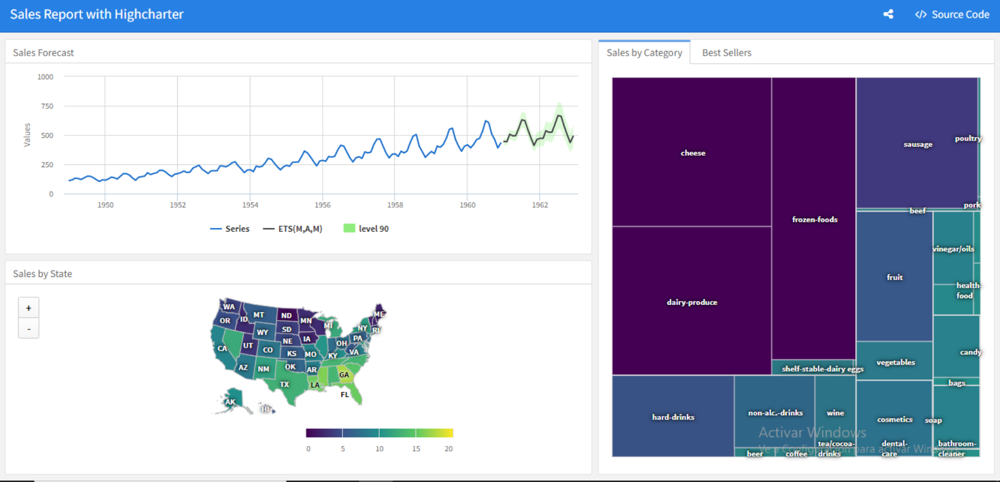
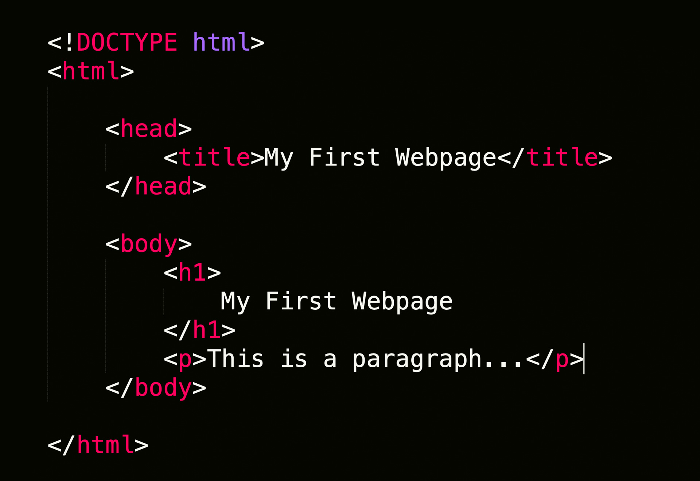
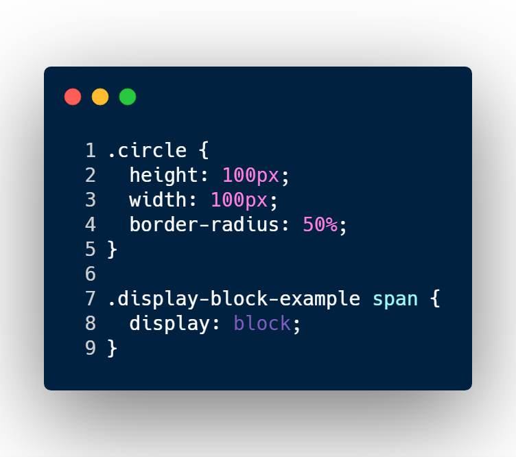

class: center, middle, inverse, title-slide

```{r some-xaringan-extra-tools, echo=FALSE}
xaringanExtra::use_panelset()
xaringanExtra::use_tile_view()
```

<style> 
    body { line-height: 35px; }

    /* Disable double-tap zoom */
    html { touch-action: manipulation; } 
    /* */
    
    .celeste-ish {
      color: rgba(100,0,50,0.75) !important;
      filter: invert(1);
      margin-left: 50px;
    }

    .resaltar {
        margin: 2px;
        padding: 2px;
        background-color: rgba(255, 243, 78, 0.891);
    }

    /* Potential fix of slide counter number position when slide overflows */
    div[class*="remark-slide-content"] {
        position: relative;
    }
    div.remark-slide-number {
        position: absolute;
        top: 0;
        right: 0;
        margin-right: 20px;
        margin-bottom: 12px;
    }

    /* Custom Xaringan panelset */
    li.panel-tab {
      border: 1.5px solid black !important;
      background-color: rgb(120, 140, 245) !important;
      background-image: linear-gradient(to bottom, rgba(0,0,0,0), rgba(0,0,0,0.25));
    }

    /* Background for last slide */
    #slide-despedida {
      background-image: repeating-radial-gradient(circle at center center, rgb(51, 21, 217,0.25) 0px, rgb(51, 21, 217, 0.25) 2px,rgb(254, 112, 5,0.25) 2px, rgb(254, 112, 5,0.25) 3px); background-size: 69px 69px; 
      background-repeat: repeat;
    }
</style> 

<h1 class = "celeste-ish">
  Taller de R Markdown y desarrollo web básico
</h1>

<br>

<h3 class = "celeste-ish">
  Autor: Lucio Cornejo
</h3>

---
## Objetivo

En este taller se presentarán las funcionalidades básicas de
**R Markdown**, una herramienta que permite incluir en
**un solo documento** 
<span class="resaltar">
_código_
</span>
(ya sea de R, Python, SQL, entre otros) correspondiente a algún proyecto y
<span class="resaltar">
_texto_
</span>
(el cual es formateado usando **Markdown**) que describe aquel proyecto.

Estos son algunos de los tipos de archivos que se
pueden crear usando **R Markdown**:

--

+ PDF
--

+ Beamer
--

+ Libros
--

+ Tableros interactivos
--

+ HTML
--

+ Sitios web
--

+ Aplicaciones web
--

+ Diapositivas HTML5

---
## Objetivo

A la mitad del taller, aprenderemos lo básico de 
**HTML**, **CSS** y **JavaScript**, herramientas de 
desarrollo web que nos permitirán personalizar y potenciar 
algunas funcionalidades de **R Markdown**.
En particular, en este taller crearemos lo siguiente 
empleando **R Markdown**:

.pull-left[
- [Reportes](#reportes)

- [Diapositivas en HTML](#xaringan)

- [Blogs](#blogdown)

- [Libros](#bookdown)

- [Tableros interactivos](#flexdashboard)

- [Aplicaciones web](#shiny)

- [Sitios web](#web-development)

]

.pull-right[

]

---
name: reportes

## Reportes

Realizaremos ejemplos simples de reportes, por ejemplo para estilizar la resolución de ejercicios con R y 
poder tener el código y los resultados obtenidos en un solo documento de tipo **R Markdown**.

Además, se aprenderá a usar parámetros para la automatización de reportes.



[Ejemplo](https://rpubs.com/j_fachrel/Linear-Regression-In-Used-Car-Price-Prediction)
de un reporte realizado con **R Markdown**.

---
name: xaringan

## Xaringan

Estas diapositivas se han generado a partir de un documento **R Markdown**, 
usando la librería de **R** conocida como **Xaringan** (porque su creador es weeb) .

De manera informal, podría decirse que **Xaringan** es una combinación de **R Markdown** y **remark.js**,
una librería de **JavaScript** para hacer diapositivas de tipo HTML, empleando el lenguaje de marcado **Markdown**.

Por lo tanto, en esta última sección del taller pondremos en práctica varias
herramientas adquiridas sobre **R Markdown**, **HTML**, **CSS** y **JavaScript**.  

[Ejemplo](https://emitanaka.org/ninja-theme/themes/kunoichi/kunoichi-theme-example.html#1)
de presentación realizada con **Xaringan** en un documento **R Markdown**.

Actualmente, 
<span class="resaltar">
    en un mismo documento
</span>
**R Markdown** no funcionan correctamente 
<span class="resaltar">
  de manera simultánea
</span>
las librerías **Shiny** y **Xaringan**.

Sin embargo, es posible evitarse ese problema si se publica online el proyecto realizado con
**Shiny** y luego se adjunta ese proyecto (vía su link del sitio web) en una presentación de **Xaringan** 
vía un
[iframe](https://twitter.com/_bcullen/status/1305273775630426112?s=20).

---
name: blogdown

## Blogdown

Emplearemos este paquete de **R**, **Blogdown**, para crear un sitio web.

La página de internet que crearemos en este taller funcionará como un portafolio para que el
alumno incluya proyectos en los que se encuentra trabajando o que ya ha desarrollado.

El paquete **Blogdown** cuenta con varias plantillas del modelo del sitio web por
crear. 

A continuación, puedes observar algunos ejemplos de blogs creados con **R Markdown**.
<br><br>

<div style="text-align: left;">
    <a href="https://isabella-b.com/">https://isabella-b.com/</a>
</div>
<br>

<div style="text-align: center;">
    <a href="https://shinydevseries.com/">https://shinydevseries.com/</a>
</div>
<br>

<div style="text-align: right;">
    <a href="https://hugo-apero-docs.netlify.app/">https://hugo-apero-docs.netlify.app/</a>
</div>

---
name: bookdown

## Bookdown

Se hará una corta introducción a este paquete de **R**, el cual permite crear libros en formato HTML, PDF o EPUB.

Puedes hacer click en las siguientes imágenes para ver algunos libros creados con la librería **Bookdown**.

[](https://bookdown.org/yihui/rmarkdown/)

<br>

[](https://bookdown.org/yihui/rmarkdown-cookbook/)

---
name: flexdashboard

## Flexdashboard

El paquete de **R** llamado **flexdashboard** nos permitirá crear tableros interactivos (_dashboards_)
estáticos o dinámicos. Puedes hacer click en las siguientes imágenes para ver algunos ejemplos de dashboards.

[](https://beta.rstudioconnect.com/jjallaire/htmlwidgets-showcase-storyboard/htmlwidgets-showcase-storyboard.html)

<br>

[](https://beta.rstudioconnect.com/jjallaire/htmlwidgets-highcharter/htmlwidgets-highcharter.html#sales-by-category)

---
name: shiny

## Shiny

Este paquete de **R** nos permite condicionar la ejecución de código (ya sea de R, Python, C, SQL, JavaScript, 
[entre otros](https://yihui.org/knitr/demo/engines/)) en un documento **R Markdown** vía un servidor proporcionado por *R Studio*,
en base a interacciones del usuario con el sitio web donde está almacenado el proyecto **Shiny** realizado en **R** o en **R Markdown** .  

Emplearemos simultáneamente los paquetes **Shiny** y **Flexdashboard** para la creación de dashboard interactivos.  

Exploraremos algunas de las limitaciones de **Shiny** y cómo podemos afrontarlas empleando el conocimiento adquirido sobre desarrollo web.

Les recomiendo experimentar con este par de proyectos soprendentes elaborados usando **Shiny** y **JavaScript**:

.pull-left[
    <a href="https://yihui.shinyapps.io/voice/">https://yihui.shinyapps.io/voice/</a>
]

.pull-right[
    <a href="https://yihui.shinyapps.io/face-pi/">https://yihui.shinyapps.io/face-pi/</a>
]

---
name: web-development

## HTML, CSS y JavaScript

<p style="margin-bottom: -50px;"> &nbsp; </p>

.panelset[
.panel[.panel-name[HTML (HyperText Markup Language)]
    Contrastaremos lo aprendido sobre *Markdown*, versus este nuevo lenguaje, **HTML**, 
    con el fin de comprender con mayor profundidad la estructura previamente inexplorada 
    de un archivo de tipo **R Markdown**, para poder alterarla como deseemos.
    <p style="margin-bottom: -20px;"> &nbsp; </p>
    <center>
        
    </center>
]

.panel[.panel-name[CSS (Cascading Style Sheets)]
    Aprenderemos a alterar el estilo de los elementos que conforman
    el resultado **HTML** de un documento **R Markdown**, lo cual nos
    permitirá personalizar sus propiedades visuales como queramos. 
    <center>
        
    </center>

]

.panel[.panel-name[JavaScript]
    Con la finalidad de potenciar nuestro control sobre el resultado final de un archivo
    de tipo **R Markdown**, se realizará una introducción básica al lenguaje de programación
    **JavaScript**.  
    De esa manera, también podremos incrementar la interactividad de nuestros documentos realizados con **R Markdown**.
    <p style="margin-bottom: -20px;"> &nbsp; </p>
    <center>
        
    </center>
]
]

???

El uso de \ como line break parece no funcionar en Xaringan.  
Sin embargo, el line break que consiste en dejar dos espacios vacíos al final de una línea
funciona incluso dentro de los `. panel[...]`  
Entonces, vale la pena enseñar también esa versión de line break.

---
name: despedida
class: invert, middle, center

## ¡Nos vemos en enero!


<script>
    // Code to fix the change of slide when scrolling and when clicking some anchors
    let touchmoved;
    $('div.remark-slide-container').on('touchend', function(event){
        if(touchmoved === true) {
            // Do not change slide if scrolling took place
            event.preventDefault(); 
            event.stopPropagation();
        } else {
            if(event.target.tagName === "IMG") {
                if (event.target.parentNode.getAttribute("href").includes("https:")) {
                    // If there was no scrolling and the user clicked on an image
                    // which has an anchor, then do not change slide and open
                    // in a ne window the site linked to image touched
                    event.preventDefault(); 
                    event.stopPropagation();
                    window.open(event.target.parentNode.getAttribute("href"));
                } 
            }
        }
    }).on('touchmove', function(){
        touchmoved = true;
    }).on('touchstart', function(){
        touchmoved = false;
    });

    //// Code to chage between slides depending on user screen swipe ////
    // Such option is supossed to work already in Xaringan, but it was not working for me :(
    let touchstartX = 0;
    let touchendX = 0;
    let swiped = false;

    function conditional_swipe() {
        // Swiped left
        if (touchendX < touchstartX) {
            if ( (touchstartX - touchendX) > (screen.availWidth)*0.25 ) slideshow.gotoNextSlide();
        } else {
            // Swiped right, because swiped equals true
            if ( (touchendX - touchstartX) > (screen.availWidth)*0.25 ) slideshow.gotoPreviousSlide();
        }
    }
        
    $('div.remark-slide-container').on('touchstart', event => {
        touchstartX = event.changedTouches[0].screenX;
        swiped = false;
    });

    $('div.remark-slide-container').on('touchmove', function() { swiped = true; });

    $('div.remark-slide-container').on('touchend', event => {
        touchendX = event.changedTouches[0].screenX;
        if (swiped === true) conditional_swipe();
    });
</script>
